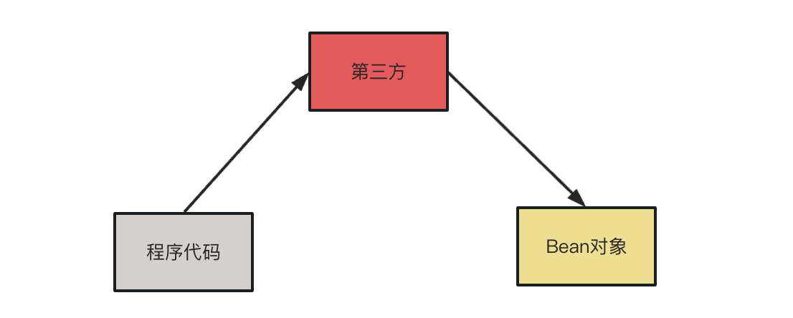
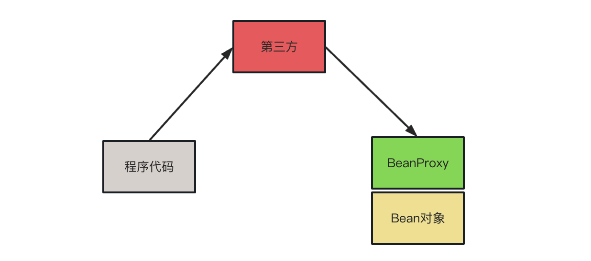

**看看下面的代码，你在JavaWeb阶段是不是很熟悉?**
***
```java
public class UserInfoServiceImpl {

    // 用户账户信息修改业务
    public void updateUserInfo(User user) {
        try {
            // 开启事务
            DaoUtils.openTransaction();

            // 插入User数据
            UserDao userDao = new UserDaoImpl();
            userDao.updateUserInfo(user);

            // 修改成功，记录日志
            UserLog userLog = new UserLogImpl();
            userLog.recodeUserUpdate(user);

            // 提交事务
            DaoUtils.commit();
        } catch (Exception e) {
            // 回滚事务
            DaoUtils.rollback();
            
            // 异常，记录日志
            ExceptionLogImpl exceptionLog = new ExceptionLogImpl();
            exceptionLog.recodeException(this,e);
        }
    }
}
```

**你能看出上面代码存在的什么问题吗？**
***
1. 当我们想调用Dao层和日志是不是得先自己new出对象，然后调用方法呢？  
2. 假设一下： 
   - 如果Dao层的对象有改动，比如说我把 `UserDaoImpl` 的类名改成了 `UserInfoDaoImp` 那么 `UserInfoServiceImpl` 中的 `new UserDaoImpl();` 是不是也得跟着改？你不改它就报错！
   - 如果有很多的 Service层 去 `new UserDaoImpl();` 那所有的 service 也得跟着改，很明显程序的藕合性太大了！触一发而动全身啊！
3. 发现没，我们在业务代码中掺杂了一些事务跟日志代码，这些东西并不属于业务代码，导致了业务代码和通用代码耦合了
   
**层与层之间的耦合性太强了怎么办？**
***
不如这样，既然程序员自己new的对象耦合性太强了，那干脆不自己new了，直接去找一个成熟的第三方来为程序提供需要的Bean对象


**业务代码和通用代码耦合怎么办?**  
***
之前说到我们已经不自己new对象了，而是找个第三方帮助程序提供Bean对象，不如再让第三方通过设计模式帮我们把业务代码和通用代码解耦



