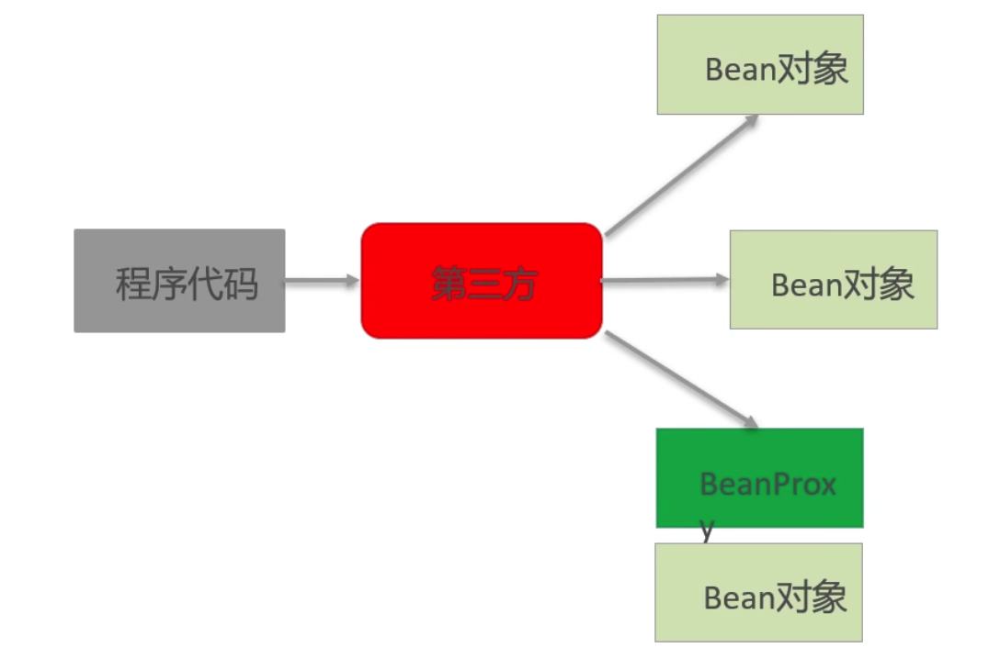

**IOC**
Inversion of Control，控制反转，强调的是原来在程序创建Bean的权利反转给第三方

**DI**
Dependency Injection，依赖注入，强调Bean之间的关系，这种关系第三方负责去设置

**AOP**
Aspect Oriented Programming，面向切面编程，功能的横向抽取，主要的实现方式就是Proxy

**框架概念的出现**
- 框架（Framework），是基于基础技术至上，从众多业务中抽取的通用解决方案
- 框架是一个半成品，使用框架规定的语法开发可以提高开发效率，可以用简单的代码就能完成复杂的基础业务
- 框架内部使用大量的设计模式、算法、底层代码操作技术，如反射、xml解析、注解解析等
- 框架一般具备扩展性，有了框架，我们可以将精力尽可能地投入在纯业务开发上而不用去操心技术的实现
