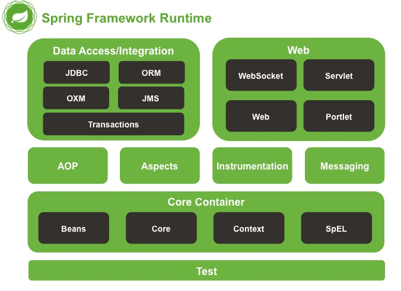

Spring是一个开源轻量级Java开发应用框架，可以简化企业级应用开发，Spring解决了开发者在JavaEE开发中遇到的许多常见的问题，提供了功能强大的IOC、AOP、WebMVC等功能，是企业中Java开发几乎不能缺少的框架之一，Spring的生态及其完善，不Spring哪个领域的解决方案都是依托于SpringFramework基础框架的
。
  
**Spring框架的历史**
- jsp默默抗下一切
- MVC+三层架构分工明确，但开发成本及其高
- EJB重量级框架出现，走出一个困境，又进入另一个困境
- Spring春天到来，随之，SSH风生水起，武林争霸
- Spring稳住江湖大哥位置，SSM开始上位
- Spring本着【拿来主义】的思想快速发展，生态不断健全
- SpringBoot又一里程碑崛起，把【约定大于配置】的思想玩得炉火纯青
- SpringCloud打包了微服务众多解决方案，应对互联网项目更加easy

**SpringFramework技术栈**

- Web：Web开发
- AOP：面向切面编程
- Aspects：AOP思想实现
- Core Container：核心容器
- Test：单元测试与集成测试
