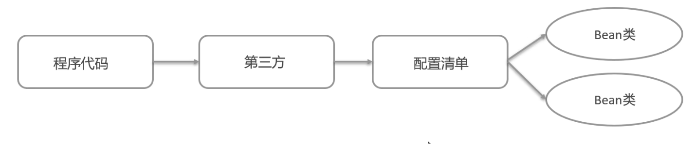

**导入Spring的Maven坐标**
```xml
<dependency>
    <groupId>org.springframework</groupId>
    <artifactId>spring-context</artifactId>
    <version>5.3.7</version>
</dependency>
```

**定义UserService接口及其UserServiceImpl**
```java
public interface UserDao {
    
}

public class UserDaoImpl implements UserDao {

}
```
**创建beans.xml配置文件，将UserServiceImpl的信息配置到该xml中**
```xml
<!--配置UserServiceImpl-->
<bean id="userService" class="com.kafe.service.impl.UserServiceImpl"></bean>
```
**编写测试代码，创建BeanFactory，加载配置文件，获取UserService实例对象**
```java
public class BeanFactoryTest {
    public static void main(String[] args) {
        // 创建工厂对象
        DefaultListableBeanFactory beanFactory = new DefaultListableBeanFactory();
        // 创建一个xml读取器
        XmlBeanDefinitionReader reader = new XmlBeanDefinitionReader(beanFactory);
        // 读取配置文件给工厂
        reader.loadBeanDefinitions("beans.xml");

        // 根据id获取bean对象
        UserService userService = (UserService) beanFactory.getBean("userService");
        System.out.println(userService);
    }
}
```
