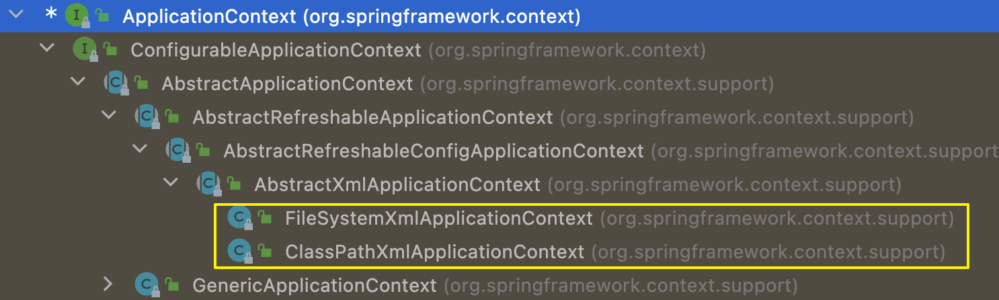
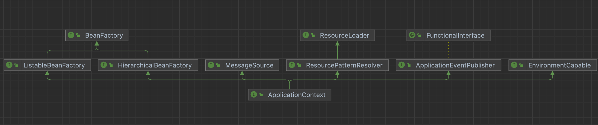

- BeanFactory是Spring的早期接口，称为Spring的Bean工厂，ApplicationContext是后期更高级的接口，称为Spring容器  
- ApplicationContext在BeanFactory基础上对功能进行了扩展，例如：监听功能、国际化功能等，BeanFactory的API更偏向底层，ApplicationContext的API大多数是对这些底层API的封装  
- Bean创建的主要逻辑和功能都被封装在BeanFactory中，ApplicationContext不仅继承了BeanFactory，而且ApplicationContext内部还维护着BeanFactory的引用，所以，ApplicationContext与BeanFactory既有继承关系，又有融合关系

- Bean的初始化时机不同，原始BeanFactory是在首次调用getBean时才进行Bean的创建，而ApplicationContext则是配置文件加载，容器一创建就将Bean都实例化并初始化好
